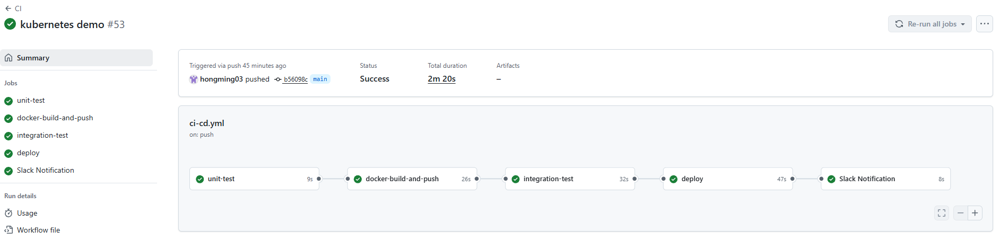
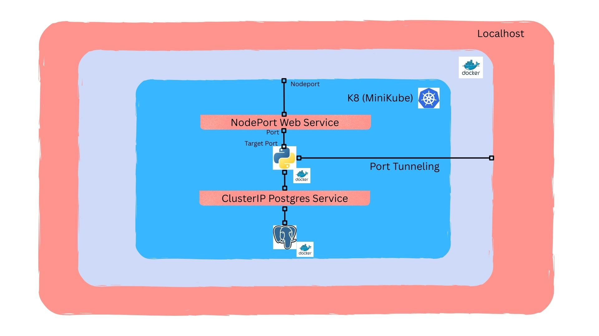

# CI/CD Project

## Overview
This project demonstrates a complete CI/CD pipeline for a web application using Docker, Kubernetes, and GitHub Actions. It covers containerization, deployment, and automation from code commit to deployment.

## Demo
[Watch Demo](demo/CICD_Demo.mp4)

## Features
- Dockerized web and database services
- Kubernetes deployment using Minikube
- CI/CD pipeline with GitHub Actions
- Deployment handled via GitHub Actions self-hosted runner
- Secure environment variable management via GitHub Actions secrets
- Port forwarding for local testing

## Tech Stack
- **Programming Language:** Python
- **Containerization:** Docker, Docker Compose
- **Orchestration:** Kubernetes (Minikube)
- **CI/CD:** GitHub Actions (self-hosted runner for deployment)
- **Database:** PostgreSQL

## How It Works
- GitHub Actions triggers on push to the main branch
- CI workflow builds Docker images for web and PostgreSQL database
- Images are pushed to Docker Hub
- CD workflow deploys the application to Kubernetes using a self-hosted runner, which pulls the Docker image from Docker Hub and applies the Kubernetes manifests
- Environment variables are securely managed using GitHub Actions secrets

## CI/CD Pipeline Jobs

## Kubernetes Diagram

## Challenges / Lessons Learned
- Port forwarding issues when running Minikube in Docker
- Securely managing environment variables using GitHub Actions secrets
- Ensuring PostgreSQL container started in time for integration tests – solved with health checks
- Setting up GitHub Actions self-hosted runner for deployment

